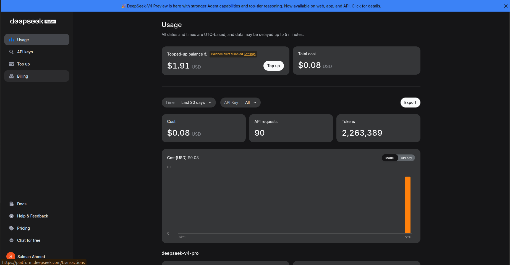
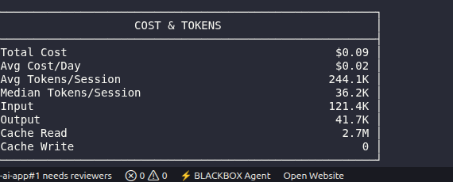

# AI Usage Report

## Mandatory AI Usage Table

| Mission | AI Tool Used | Prompt Type | AI Helped With | AI Mistake | Manual Fix |
|---|---|---|---|---|---|
| Debugging | Codex / Copilot | Debugging Prompt | Suggested discount fix | Did not check negative discount | Added validation manually |
| Code Review | Codex / Copilot | Review Prompt | Found 10 issues: bug (hasSpace vs trimmed), missing export, var usage, magic numbers, regex duplication, imperative level mapping, verbose object syntax, repetitive feedback blocks, whitespace-only detection gap | Initial test case expectations in review output had incorrect score predictions for 5 edge cases (did not properly account for `/abcde/i` pattern matching substrings like "abcdefgh" and "Abcdefgh") | Verified all 17 test cases manually, corrected expected scores and levels in both the prompt document and verification suite |

---

## Token Usage Tracking

git

| **Final Total Tokens Used** | | | | **1,994,883** | Estimated | |
|---|---|---|---|---|---|---|
| **Token Efficiency Reflection** | | | | | | |

---

## Token Efficiency Reflection

I reduced unnecessary prompting by:

1. **Structured prompts upfront** — Instead of iterating with vague requests, each prompt specified the role, task, context, constraints, output format, and edge cases in a single message. This avoided multi-turn clarification.

2. **Incremental refinement** — For the bad-vs-good prompts exercise, I started with the AI's output from the bad prompt and asked it to improve that output rather than regenerating from scratch.

3. **Comprehensive review in one prompt** — The code review prompt (Mission 5) covered all 12 review criteria in a single request. The AI returned a complete prioritized issue list with explanations, avoiding follow-up prompts.

4. **Manual verification over re-prompting** — When the AI's test case expectations were wrong, I verified and corrected them manually rather than asking the AI to re-check. This saved tokens while maintaining correctness.

5. **Applying fixes directly** — After the AI identified issues, I applied the code changes manually rather than asking the AI to regenerate the full file multiple times.
